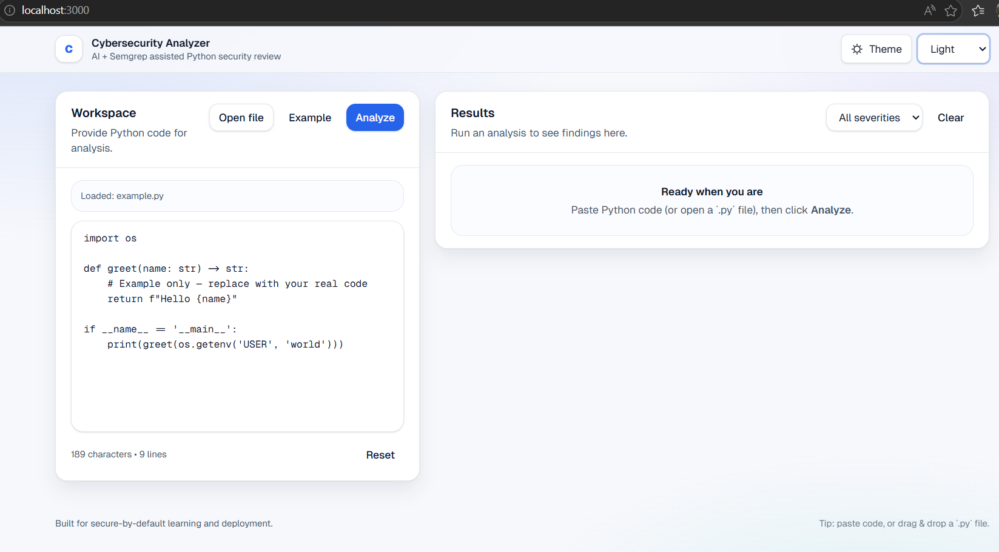

# AI Cybersecurity Analyzer

Analyze Python code for security vulnerabilities using **Semgrep** combined with an **AI-powered analysis agent**. The agent integrates external tooling via the **Model Context Protocol (MCP)**—notably the **Semgrep MCP server**—so scans run through a standardized tool surface alongside the LLM. The stack is designed for cloud deployment on **Azure Container Apps** and **Google Cloud Run** using Terraform-managed infrastructure.

---

## Demo



---

## Tech Stack

- **Frontend**: Next.js, React, Tailwind CSS  
- **Backend**: FastAPI (Python)  
- **AI / Analysis**: OpenAI-powered agent + Semgrep  
- **Tooling integration**: MCP (Semgrep MCP server for agent-invoked scans)  
- **Infrastructure**: Terraform (Infrastructure as Code)  
- **Containerization**: Docker  
- **Runtime / Tooling**: Node.js, npm, uv  
- **Cloud Platforms**: Azure Container Apps, Google Cloud Run  

---

##  What this project does

- **Input**: Paste Python code or upload a `.py` file  
- **Analyze**: Sends code to `POST /api/analyze`  
- **Processing**:
  - Semgrep detects known vulnerability patterns  
  - AI agent enhances and contextualizes findings  
- **Output**:
  - Executive summary  
  - Prioritized vulnerabilities (CVSS-based)  
  - Actionable security insights  

---

##  Cloud-Native Design

This application is built with **cloud deployment in mind**:

- Fully **containerized** using Docker  
- Deployable via **Terraform** to multiple cloud providers  
- Supports **serverless container platforms**:
  - Azure Container Apps  
  - Google Cloud Run  
- Scales automatically based on demand  

---

##  UI Highlights

- Modern **dashboard-style layout**
- Fully **responsive design** (mobile + desktop)
- Reusable UI components (`Button`, `Card`, `Badge`, `Alert`, `Skeleton`)
- Smooth **loading states** with skeletons
- Clear and user-friendly **error handling**
- **Dark mode support** (light / dark / system)
- Subtle animations (respects reduced motion settings)

---

##  Project Structure

```
cyber/
  backend/                 # FastAPI API (runs :8000)
  frontend/                # Next.js + Tailwind (runs :3000 in dev)
    src/
      app/                 # App Router entrypoints
      components/
        app/               # Layout + navigation
        theme/             # Theme provider + toggle
        ui/                # Reusable UI primitives
      features/
        analyze/           # Analysis logic + UI panels
      types/               # Shared API types
  terraform/               # Infrastructure as Code (cloud deployment)
  week3/                   # Guides and documentation
```

---

##  Setup

### 1) Environment Variables

Create a `.env` file in the project root:

```
OPENAI_API_KEY=your_key_here
SEMGREP_APP_TOKEN=your_token_here
```

---

### 2) Run Locally (Two Terminals)

#### Backend

```bash
cd backend
uv run server.py
```

#### Frontend

```bash
cd frontend
npm ci
npm run dev
```

Open: http://localhost:3000

---

##  Run with Docker

```bash
docker build -t cyber-analyzer .
docker run --rm -p 8000:8000 --env-file .env cyber-analyzer
```

Open: http://localhost:8000

---

##  Cloud Deployment (Production)

### Microsoft Azure
- Deploys via **Azure Container Apps**
- Uses:
  - Azure Container Registry  
  - Log Analytics  

### Google Cloud Platform
- Deploys via **Cloud Run (serverless containers)**
- Uses:
  - Container Registry  
  - Cloud Build  

Infrastructure is fully managed using **Terraform**, enabling reproducible, multi-cloud deployments.

> After deployment, Terraform outputs a public URL to access the application.

---

##  Notes

- API requests use relative paths (`/api/*`) in production  
- Environment variables are required for AI + Semgrep integration  
- `.env` is excluded from version control for security  

---

##  Future Improvements

- Multi-agent analysis pipeline  
- Real-time monitoring and observability  
- Custom Semgrep rule management  
- CI/CD automation  
